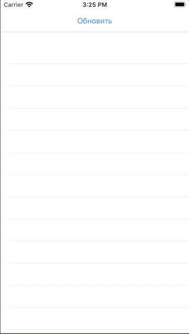

# Разработка сетевого слоя приложения (Alamofire, JSON, Codable/Decodable) 

## Домашнее задание

1. Необходимо написать приложение, отображающее список тем курсов с подробным описанием и возможно открывающимися ссылками во внешнем браузере (это надо погуглить). Наилучшим результатом может служить приложение, полностью повторяющее дизайн и контент в [Web версии](https://altgo.altarix.org/public/event?id=F95908B6-492E-4D4A-B780-66E9DFE413E4), разумеется только в реалях iOS. [API брать здесь](https://altgo.altarix.org/api/event?id=F95908B6-492E-4D4A-B780-66E9DFE413E4)

2. Дополнительно: используйте UIActivityIndicatorView для того чтобы показать процесс загрузки

3. Задание повышанной сложности: используйте [PromiseKit](https://github.com/mxcl/PromiseKit) для того чтобы сделать сетевой слой красивее

# Хранение данных (UserDefaults, Keychain, CoreData, Realm) 

## Домашнее задание

### Цель:
Научится пользоваться Keychain и Realm для хранения данных.
Совместить с ранее полученными знаниями по сетевому слою.
### Задача:
Доработать расписание занятий, чтобы URL было изменяемым и настраиваемым и чтобы данные кешировались без повторного обращения к сети.
### Дополнительно:
1.Сделать механизм pool to refresh, то есть чтобы данные из кеша обновлялись по требованию пользователя.
2.Совместить в одной модели модель хранения и сетевой отдачи данных, чтобы не плодить лишних сущностей.

### ver 2.0
Реализован базовый функционал:
- [x] реализована общая модель для хранения Realm DB и парсинга JSON объекта
- [x] кешируется в Realm DB результат обновления API и загружается при загрузке приложения
- [x] Кнопка-заголовок позволяет обновить API
- [x] База автоматически очищается после удаления, хранит только последние актуальные данные 

### В планах:
1) Реализовать интерфейс близкий к дизайну на сайте (иконки)
2) Пофиксить индикатор (съезжает на строчку в первой ячейке)
3) Изучить Promise и реализовать на нëм

### История версий
### ver 1.0
Реализован базовый функционал:
- [x] сетевой слой: получение данных из API
- [x] создание таблиц с данными и передача данных между View
- [x] добавлен UIActivityIndicatorView
- [x] переход между таблиц через Navigation Bar 

